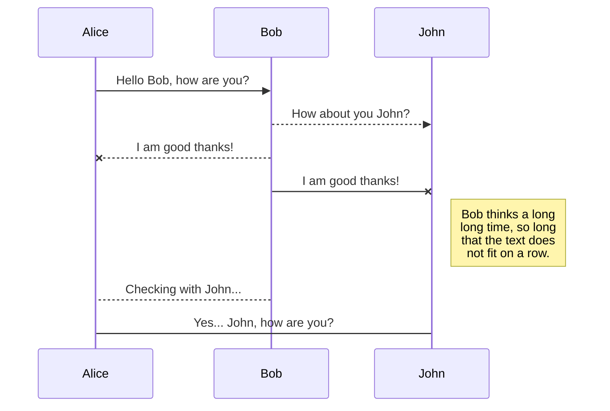

## docker local repository
```
mkdir /root/volume
vi /root/docker-compose.yaml
```

```
version: '3'

services:
    docker-registry:
        container_name: docker-registry
        image: registry:2
        ports:
            - 5000:5000
        restart: always
        volumes:
            - ./volume:/var/lib/registry
    docker-registry-ui:
        container_name: docker-registry-ui
        image: konradkleine/docker-registry-frontend:v2
        ports:
            - 8080:80
        environment:
            ENV_DOCKER_REGISTRY_HOST: docker-registry
            ENV_DOCKER_REGISTRY_PORT: 5000
```
## Pushing to the Local Docker Registry
Pushing to a local Docker Registry is as easy as tagging an image with the registry name (the hostname or IP of your registry + port number) and pushing.

For example:
```
docker tag your_docker_image your_hostname.local:5000/your_docker_image
docker push your_hostname.local:5000/your_docker_image
```

## Pulling from a Local Docker Registry
Pulling is similarly simple.

```
docker pull your_hostname.local:5000/your_docker_image
```


